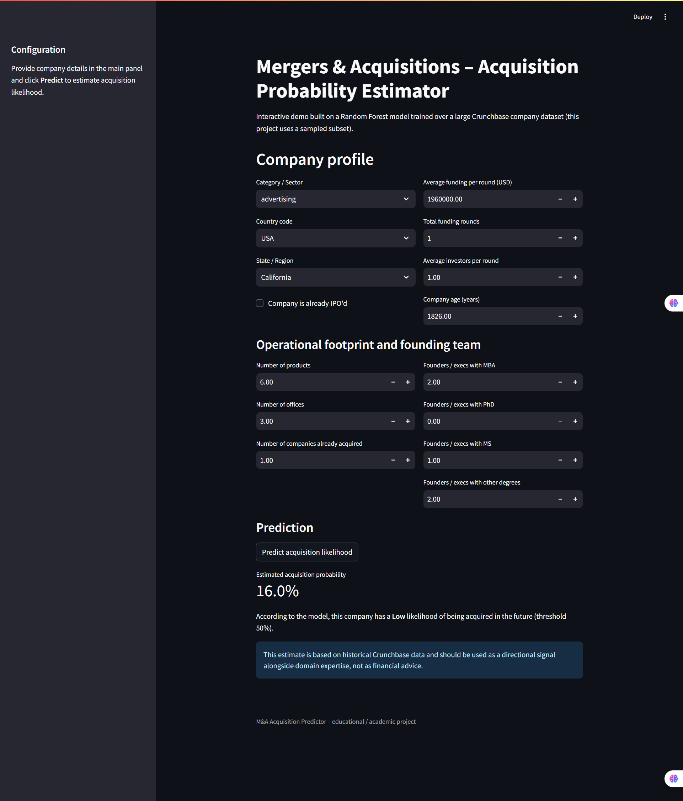

# Predictive Modeling of Mergers and Acquisitions

**Timeline:** Jan 2025 – Apr 2025  
**Project type:** Self-initiated data science project

## Objective

Develop a predictive **Mergers & Acquisitions (M&A)** model using Crunchbase-derived
company data (500k+ datapoints in the original dataset; this repository uses a
curated subset for reproducibility).  
The goal is to estimate the probability that a given company will be acquired,
based on its funding history, sector, geography, age and executive team profile.

## Approach

### 1. Data preprocessing & feature engineering

- Utilized **Pandas** and **NumPy** for data loading, cleaning and transformation.
- Handled missing values, outliers and type casting for numerical / categorical
  variables (funding, age, sector, country, degrees, IPO status, etc.).
- Built a reproducible preprocessing pipeline using **scikit-learn**:
  - `SimpleImputer` for missing-value imputation.
  - `StandardScaler` for numeric feature scaling.
  - `OneHotEncoder` for categorical feature encoding.
- Persisted the fitted preprocessor (`preprocessor.joblib`) and exported
  processed train/test matrices to `data/processed/`.

### 2. Exploratory Data Analysis (EDA)

- Performed **Exploratory Data Analysis (EDA)** using **Seaborn** and **Matplotlib**:
  - Distribution of acquisition outcomes (acquired vs non‑acquired).
  - Relationship between funding intensity and acquisition probability.
  - Effect of company age and IPO status on acquisition likelihood.
  - Acquisition rate across top industry categories.
- EDA reports and visualizations are written to `reports/eda/` via
  `scripts/eda.py`.

### 3. Predictive modeling

- Trained a **Random Forest Classifier** (`scripts/model.py`) on the processed
  feature matrix.
- Evaluated performance using:
  - Accuracy
  - Precision, recall and F1-score (via `classification_report`).
- Saved the final model as `models/acquisition_model.joblib` for downstream use.

### 4. Interactive UI

- Implemented a minimal **Streamlit** web UI (`app.py`) that:
  - Accepts company-level inputs such as sector, geography, funding, age and
    executive degrees.
  - Uses the persisted preprocessing pipeline and trained model to generate an
    acquisition probability.
  - Presents an interpretable textual summary of the prediction, suitable for
    decision-support and exploratory “what-if” analysis.

## Results

- Successfully developed a model that provides **actionable insights** into
  M&A activity:
  - Highlights how funding intensity, company age and sector are associated
    with higher acquisition probabilities.
  - Provides an instant probability estimate for a hypothetical or real
    company via the Streamlit UI.
- The codebase is modular and production‑oriented:
  - Separate scripts for EDA, feature extraction and model training.
  - Artifacts (preprocessor + model) are saved for reuse in analytical tools
    or dashboards.

## How to run

1. Create a virtual environment and install dependencies:

   ```bash
   pip install -r requirements.txt
   ```

2. Run EDA and generate plots (optional but recommended):

   ```bash
   python -m scripts.eda
   ```

3. Run feature extraction and model training:

   ```bash
   # Create processed train/test matrices + preprocessor
   python acquisition_prediction.py --extract

   # Train Random Forest model and print evaluation metrics
   python acquisition_prediction.py --fit
   ```

4. Launch the Streamlit UI:

   ```bash
   streamlit run app.py
   ```
## 🔥 UI Preview
  


This project is designed for academic / portfolio purposes and should not be
used as standalone financial advice.
